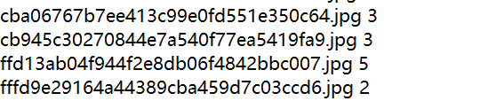

# Eye-gaze-estimation
This is an eye-gaze-estimation algorithm that implemented by Pytorch. The project also uses the additive angular margin loss that proposed in this paper ["ArcFace: Additive Angular Margin Loss for Deep Face Recognition"](https://arxiv.org/abs/1801.07698), which acquires higher accuracy than that use Softmax Loss. What's more, we used a statistic method to detect eyes base on the face region obtained by face detection, and it has good performence in our project.

# Preparation
The code is tested using PyTorch 1.1.0 and openCV 3.4.1 under Windows 10 with Python 3.7.  

# Train a model
There are two training files(Train_SoftmaxLoss.py&Train_AdditiveAngularMarginLoss .py) in this project, the former trains the model using Softmax Loss and the later trains the model using Additive Angular Margin Loss.
1. Put all your training images into a folder.
2. Create a txt file, and write the annotations information into it, the format is that an image name + a space + class of the image:

     
      
3. Edit the learning_rate.txt file so that the program can get the learning rates from this file during training.
4. Specify the default options in parse_arguments function of training file and run the file.

# Test the model
Modify the Test.py to specify trained model, annotations file and the image path and then run this file to get test accuracy.

# A demo
A demo is provided here, it captures user's images by Kinect v2 and then user's face region is obtained through face detection. We use a statistic method base on the face region to detect eyes, finally, we put the eye region into our model to get the eye gaze direction. Specifically, we apply cascade Adaboost method provided in openCV to detect faces. We assume that the functional relationship between eye position and the side length of face region is Y=θ∅, here, Y denotes the coordinates of eye area, θ is a coefficient matrix and ∅ is a vector that composed of side lenth of face region. We use the least squares method to fit the data to get the coefficient matrix θ, so that we can detect eyes.

 

